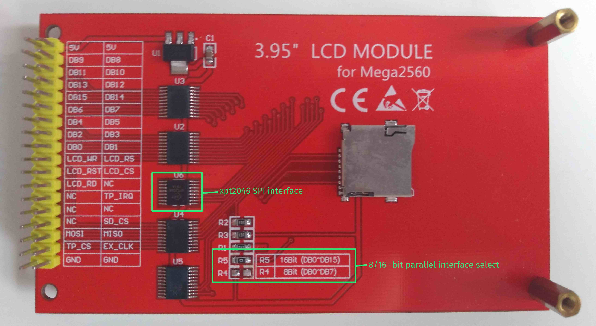

# ST7796S STM32 LCD Driver

Based on [Roberto Benjami's STM32 LCD drivers](https://github.com/RobertoBenjami/stm32_graphics_display_drivers) 

Supports 8-bit or 16-bit parallel interface

## Setup

## App

